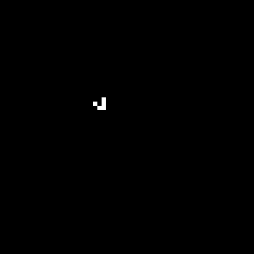
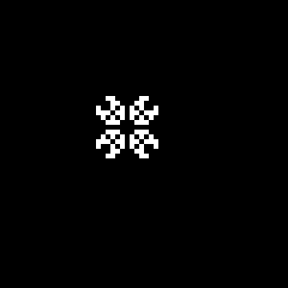
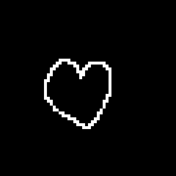

# 🧫 GameOfLife2D — Gra w Życie Conway'a i HighLife

> **PL** | Interaktywna implementacja Gry w Życie (Conway, B3/S23) z obsługą reguł HighLife (B36/S23), rysowaniem myszką, wbudowanymi wzorcami i eksportem do GIF.
>
> **EN** | Interactive implementation of Conway's Game of Life (B3/S23) with HighLife rules (B36/S23), mouse drawing, built-in patterns and animated GIF export.

---

## 🇵🇱 Opis projektu

**Gra w Życie** to jeden z najbardziej znanych dwuwymiarowych automatów komórkowych, zaproponowany przez matematyka Johna Conwaya w 1970 roku. Na siatce komórek, z których każda jest żywa (1) lub martwa (0), ewolucja przebiega według czterech prostych reguł opartych wyłącznie na liczbie żywych sąsiadów (sąsiedztwo Moore'a, 8 komórek). Pomimo tej prostoty układ wykazuje zaskakująco złożone zachowanie emergentne.

Projekt oferuje pełne GUI w tkinter z możliwością **ręcznego rysowania** komórek myszką, wyboru spośród pięciu klasycznych wzorców startowych (Glider, Block, Pulsar, Pentadecathlon, Acorn), przełączenia na reguły **HighLife** (B36/S23 — tworzy replikatory) oraz nagrywania animacji do pliku GIF.

## 🇬🇧 Project Description

**Conway's Game of Life** is one of the most famous 2D cellular automata, introduced by mathematician John Conway in 1970. On a grid of cells — each alive (1) or dead (0) — evolution proceeds according to four simple rules based solely on the count of living Moore-neighbourhood (8-cell) neighbours. Despite this simplicity, the system exhibits strikingly complex emergent behaviour.

The project provides a full tkinter GUI with **mouse cell drawing**, five classic starting patterns (Glider, Block, Pulsar, Pentadecathlon, Acorn), switchable **HighLife** rules (B36/S23 — produces replicators), and animated GIF recording.

---

## 📐 Reguły / Rules

### Conway (B3/S23) — domyślne / default
```
Żywa komórka:   < 2 sąsiadów  →  umiera (samotność)
                = 2 lub 3     →  przeżywa
                > 3 sąsiadów  →  umiera (przeludnienie)

Martwa komórka: = 3 sąsiadów  →  ożywa (narodziny)
```

### HighLife (B36/S23) — tryb alternatywny / alternative mode
```
Żywa komórka:   = 2 lub 3     →  przeżywa
Martwa komórka: = 3 lub 6     →  ożywa
                               ↑ różnica: 6 sąsiadów tworzy replikatory
```

---

## 🧩 Wbudowane wzorce / Built-in Patterns

| Wzorzec / Pattern | Typ / Type | Opis / Description |
|---|---|---|
| **Glider** | Ruchomy / Moving | Porusza się po przekątnej, 4 generacje na cykl |
| **Block** | Stały / Still life | Stabilna konfiguracja 2×2 |
| **Pulsar** | Oscylator | Tętni z okresem 3 |
| **Pentadecathlon** | Oscylator | Cykl 15 pokoleń |
| **Acorn** | Metuzalem | Z 7 komórek wyrasta przez 5206 pokoleń |

---

## ✨ Funkcje / Features

| 🇵🇱 | 🇬🇧 |
|-----|-----|
| Rysowanie komórek myszką (LPM żywa / PPM martwa) | Mouse cell drawing (LMB alive / RMB dead) |
| Start / Stop / Krok po kroku | Start / Stop / Single step |
| Regulowana prędkość symulacji (suwak) | Adjustable simulation speed (slider) |
| Regulowany rozmiar siatki 50×50–200×200 | Adjustable grid size 50×50–200×200 |
| 5 wbudowanych wzorców startowych | 5 built-in starter patterns |
| Dwa warunki brzegowe (periodyczny / odbijający) | Two boundary conditions (periodic / reflective) |
| Tryb HighLife B36/S23 (replikatory) | HighLife B36/S23 mode (replicators) |
| Nagrywanie animacji i eksport GIF | Animation recording and GIF export |
| Licznik pokoleń i żywych komórek | Generation and alive cell counter |

---

## 🔄 Warunki brzegowe / Boundary Conditions

```
Periodyczny  →  siatka "zawija się" (lewa↔prawa, góra↔dół)
                Struktury mogą przechodzić przez krawędź.

Odbijający   →  komórki poza granicą traktowane jako martwe.
                Struktury "odbijają się" od ścian.
```

---

## 🛠️ Technologie / Tech Stack


```
tkinter      — interfejs graficzny, canvas, zdarzenia myszy
numpy        — siatka stanu jako tablica 2D, zliczanie sąsiadów
Pillow       — eksport klatek do animowanego GIF
```

---

## 🚀 Uruchomienie / Getting Started

### Wymagania / Requirements
```bash
pip install numpy Pillow
```

### Start
```bash
python gui.py
```

---

## 📁 Struktura projektu / Project Structure

```
GameOfLife2D/
│
├── gui.py              # Interfejs graficzny — canvas, kontrolki, obsługa myszy / GUI
└── game_of_life.py     # Logika gry — siatka, reguły, wzorce, eksport GIF / Game logic
```

---

## 🔬 Algorytm / Algorithm

```
Dla każdej generacji:
  └── Dla każdej komórki (x, y):
      ├── Policz żywych sąsiadów (sąsiedztwo Moore'a)
      │   z wybranym warunkiem brzegowym
      └── Zastosuj regułę Conway lub HighLife
          → nowa siatka (aktualizacja synchroniczna)

Synchroniczność: nowy stan wszystkich komórek obliczany
jednocześnie na podstawie stanu poprzedniej generacji.
```

---

## 📸 Zrzuty ekranu / Screenshots

|  |
| :---: |
| *Ruchomy obrazek 1. Gra w życie Conway'a - wbudowany wzorzec: glider*|
|  |
| *Ruchomy obrazek 2. Gra w życie Conway'a - wbudowany wzorzec: pulsar*|
|  |
| *Ruchomy obrazek 3. Gra w życie Conway'a - wbudowany wzorzec: pentadecathlon*|
|  |
| *Ruchomy obrazek 4. Gra w życie Conway'a - opracowany własny wzorzec na potrzeby testu gry*|

---

## 👩‍💻 Autorka / Author

**Julianna Wachowicz**
[github.com/JuliannaWach](https://github.com/JuliannaWach)
